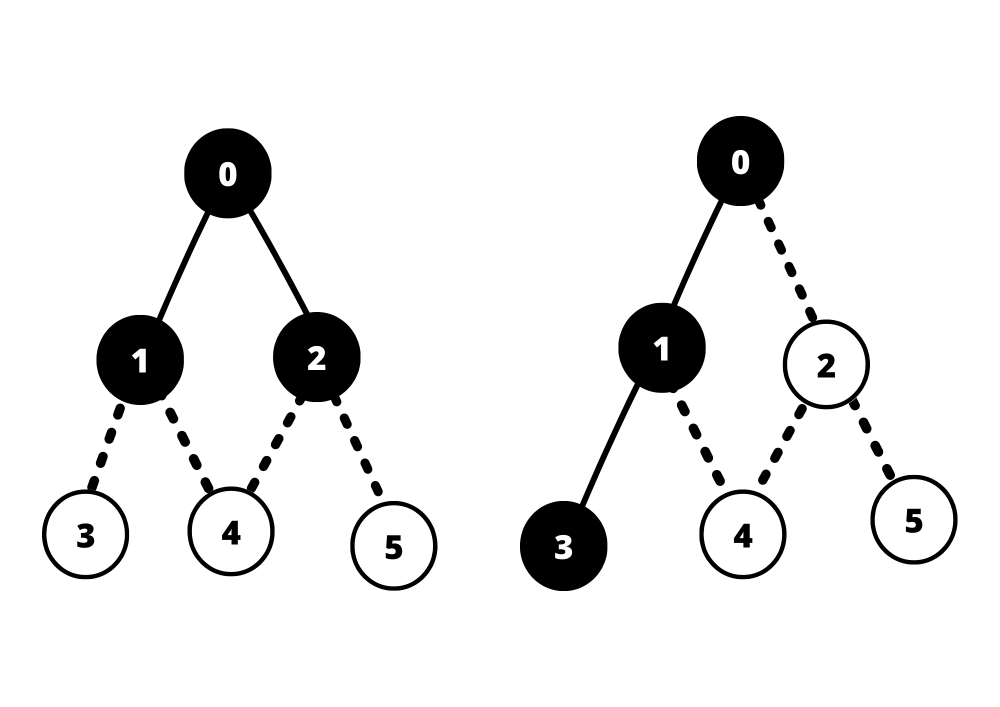
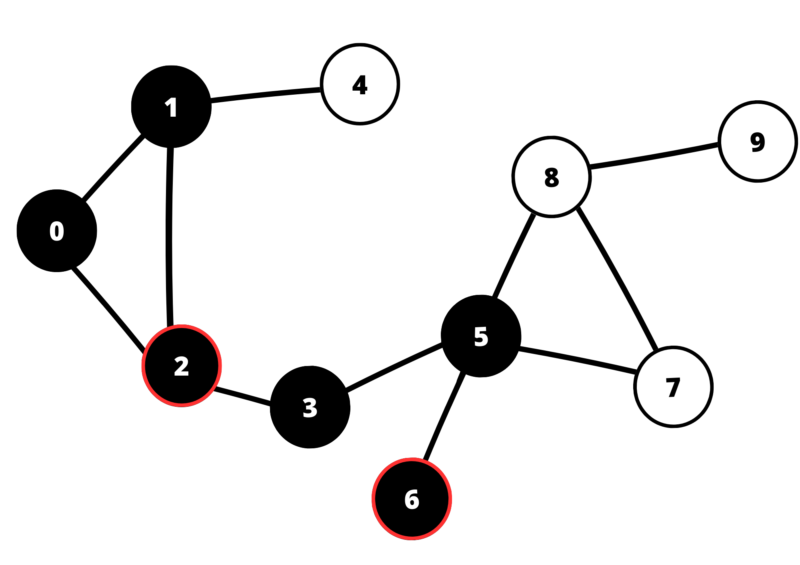
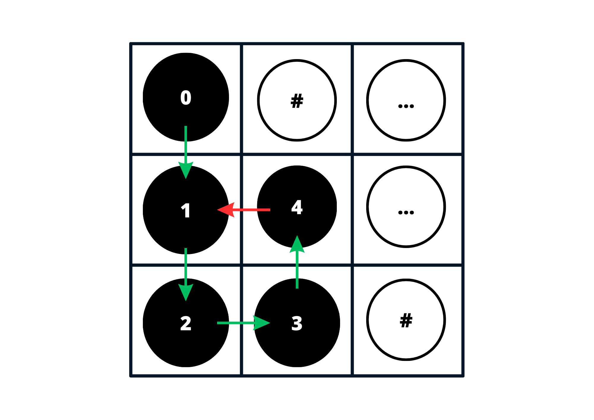

# Busca em Largura e Profundidade

#### Algoritmos e Estrutura de Dados

#### Compatibilidade e Desenvolvimento
 

  

## Índice
 - [Introdução](#Introdução)
    - [Contextualizando os Algoritmos](#contextualizando-os-algoritmos)

 - [Contexto](#contexto)
    - [Estruturas de Dados](#Estruturas-de-Dados)
    - [Algoritmos](#Algoritmos)
        - [DFS em Grafos](#DFS-em-Grafos)
        - [DFS em Matrizes Bidimensionais](#DFS-em-Matrizes-Bidimensionais)

 - [Objetivos](#Objetivoss)

 - [Metodologia](#Metodologia)
    - [Solução](#Solução)
    - [Desenvolvimento](#Desenvolvimento)
    - [Compilação e Execução](#Compilação-e-Execução)
    - [Ambiente de Desenvolvimento](#Ambiente-de-Desenvolvimento)
- [Conclusão](#Conclusão)
    - [Como melhorar a Metodologia?](#Conclusão)
    - [Reavaliando a Implementação do Algoritmo em Matrizes bidimensionais](#Conclusão)
    - [Referências](#Referências)
  

## Introdução
Este repositório apresenta  a solução para um problema proposto na disciplina de Algoritmos e Estruturas de Dados. Para isso foi requisitado que a solução fosse desenvolvida em forma de 3 algoritmos, são eles o DFS(Deep First Search, ou Busca em Profundidade), o BFS(Brandth First Search ou Busca em Largura) e uma forma de realizar buscas escolhendo entre casas adjascentes aleatoriamente. Para isso considere as seguintes colocações:

- Nomes de diretórios, ou arquivos serão referênciados da seguinte forma: `Nome.txt` ou `Diretório_2`.

- $G$ - Um grafo qualquer.

- $V$ - Conjunto de vértices de um grafo.

- $E$ - Conjunto de arestas de um grafo.

- $K$ - Número de matrizes de entrada presentes no arquivo `input.data`.

- $N$ - Ordem das matrizes sendo representada pelos 2 primeiros números da primeira linha do arquivo `input.data`, portanto o código já espera que $N \in \mathbb{Z}$ e $N\geq 0$ e não trata essa variável.

- $i$ - Índice da linha de uma matriz, também pode ser abstraído como deslocamento na vertical, tal que $i \geq 0$ e $i \in \mathbb{Z}$.

- $j$ - Índice da coluna de uma matriz, também pode ser abstraído como deslocamento na horizontal, tal que $j \geq 0$ e $j \in \mathbb{Z}$.

- $a_{ij}$ - Elemento encontrado quando há deslocamento até a linha de índice $i$ e coluna de índice $j$.

- _Tralha ou jogo da velha_ - **Parede**: Local onde não se pode passar dentro de uma matriz.

- $*$ - **Perigo**: Local onde ao se passar haverá descrescimento em 1 da variável vida.

- $a_{ij}$ - Elemento encontrado quando há deslocamento até a linha de índice $i$ e coluna de índice $j$.

- $?$ - Elemento encontrado durante o percorrimento da matriz que representa o encerramento de uma pesquisa ou a saída do labirinto.

- Nomes de comandos digitados no terminal,funções ou variáveis serão referênciados da seguinte forma: _**touch main.cpp**_, _**make run**_.

- Para as **Figuras** de **1** à **x**, considere a legenda de cores:

    -   Azul:Uma posição futura possível.</kbd>
    -   Cinza: Uma posição futura impossível.
    -   Laranja: Posição atual ou inicial.
    -   Rosa: Posição futura escolhida.

## Contexto
- Para contextualizar o funcionamento do algoritmo, considere que um personagem caminha por um labirinto até encontrar uma saída definida por um ponto de interrogação:
    - O personagem representa uma abstração para uma busca realizada em uma matriz, essa busca se encerra quando o elemento $!$ é encontrado.
    -   O caracter $*$ representa uma casa que reiniciar a pesquisa. Isso significa que, se o personagem passa pelo elemento $a_{ij} = *$, este haverá de reiniciar sua busca da posição $a_{00}$. Além disso o caminho entre $a_{ij}$ e $a_{00}$ será considerado como não percorrido.
    -   A parede representa uma casa por onde o ambicioso não consegue passar.
    
### Estruturas de Dados
- Para solucionar o problema a equipe usufruiu da alocação dos valores de entradas em elementos $a_{ij}$ de uma matriz $M$ de ordem $N$. Portanto a estrutura de dados utilizada foi uma matriz $N$ x $N$.

### Algoritmos
-  Os algoritmos para guiar o personagem idealizado, são buscas em largura e em profundidade. Estes algoritmos serão executados nas matrizes bidimensionais utilizadas como entradas no arquivo _`input.data`_.

#### DFS em Grafos
- Busca em profundiade propõe que uma única linha ou coluna seja percorrida até que se encontre o que se espera. Vale ressaltar que isso ocorre em uma matriz de duas dimensões, em um grafo, ocorre um passeio percorrendo um único vértice de adjascência do vértice atual. Outro vértice ajascente só será visitado quando a busca tiver sido realizada até um vértice de grau 1 onde seu vértice vizinho já foi visitado, ou quando um vértice tem uma única aresta não percorrida sendo esta uma ligação entre o vértice presente e um vértice já visitado. Como pode ser visto um passeio com DFS no grafo abaixo segue a ordem formalmente representada como ${Passeio}: (0, 1, 2, 3, 5, 6)$.

 
<strong>Figura 1 -</strong> DFS em grafo
 

 
Fonte: Vídeo¹.
 
____________________________________________
 Criada usando o Canva assistir ao vídeo¹, Disponível no <a href="https://www.canva.com/design/DAFd8EjV-8w/M4fX0cOTTduzNNPJxuF73Q/edit?utm_content=DAFd8EjV-8w&utm_campaign=designshare&utm_medium=link2&utm_source=sharebutton">Link</a>.

 
Observa-se que os vértices circulados de vermelho são vértices com adjascencia em vértices já visitados ou de grau 1, ou seja, isolados.

#### DFS em Matrizes Bidimensionais
- Já em matrizes bidimensionais a DFS percorre uma linha ou coluna até que encontre um caracter que a faça reorientar a busca em outra direção. As direções escolhidas não podem fazer com que a busca passe em um elemento da matriz que já foi visitado previamente. Observe como a DFS percorre um coluna por completo e tem uma seta vermelha representando que não pode se mover para $a_{10}$ pois essa posição já foi percorrida previamente.

 
<strong>Figura 2 -</strong> DFS em Matriz
 

 
Fonte: Construção pelo autor².
 
____________________________________________
 Criada usando o Canva², Disponível no <a href="https://www.canva.com/design/DAFd8EjV-8w/M4fX0cOTTduzNNPJxuF73Q/edit?utm_content=DAFd8EjV-8w&utm_campaign=designshare&utm_medium=link2&utm_source=sharebutton">Link</a>.

 
 
referências:
 
 

https://www.youtube.com/watch?v=s-CYnVz-uh4&t=122s

https://www.youtube.com/watch?v=xlVX7dXLS64

https://www.youtube.com/watch?v=125pPCIRjZ8

links úteis:
"https://graphonline.ru/pt/"

A equipe <a href = "https://github.com/Getulio-Mendes/LabirintoRecorrente">Getúlio</a>, <a href = "https://github.com/rafaegont1/O-labirinto-recorrente">Rafel</a> e <a href = "https://github.com/jAzz-hub/Recurrent_Labyrinth">João</a>