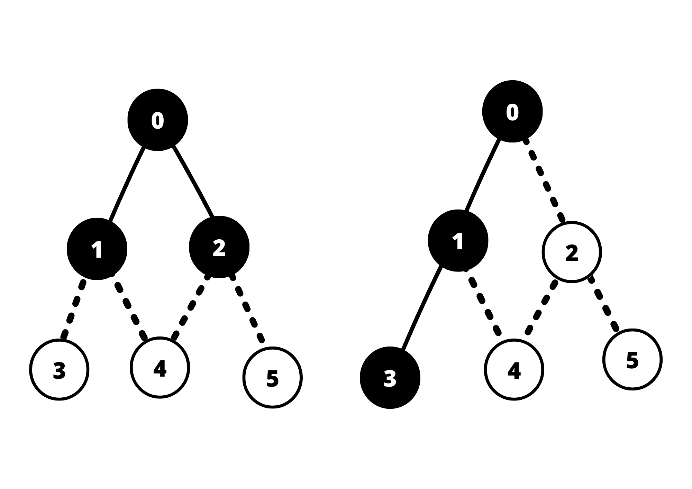
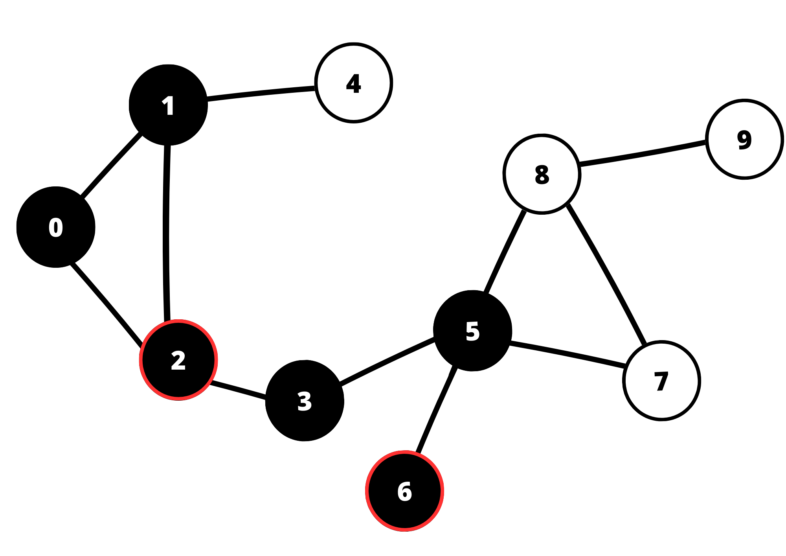
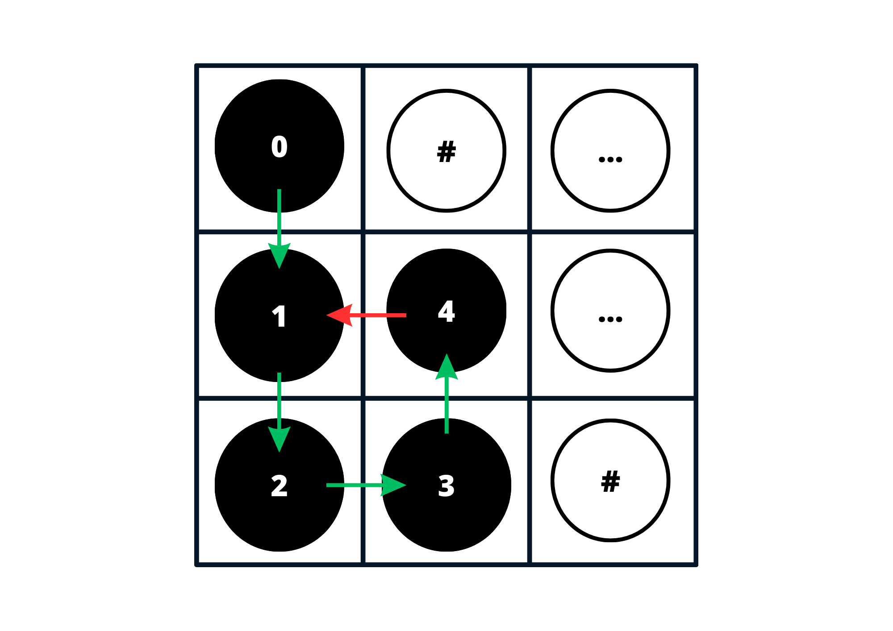
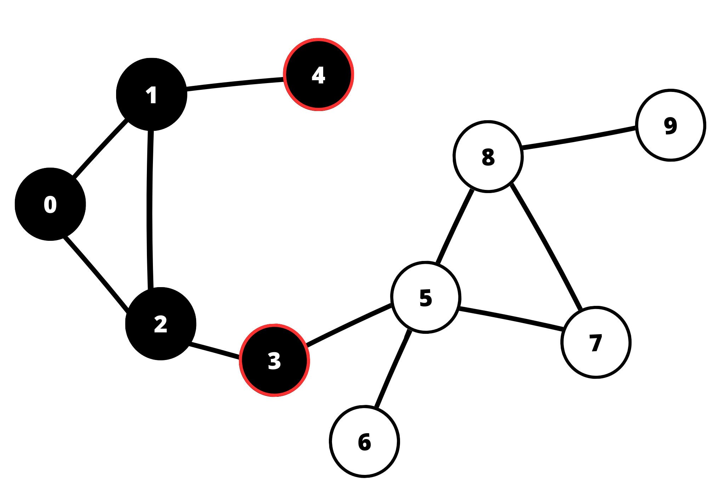
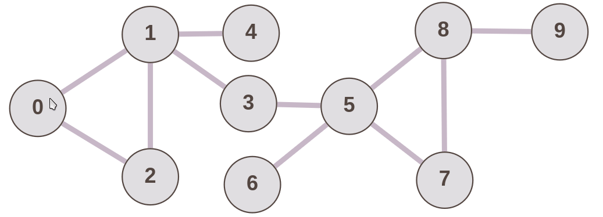
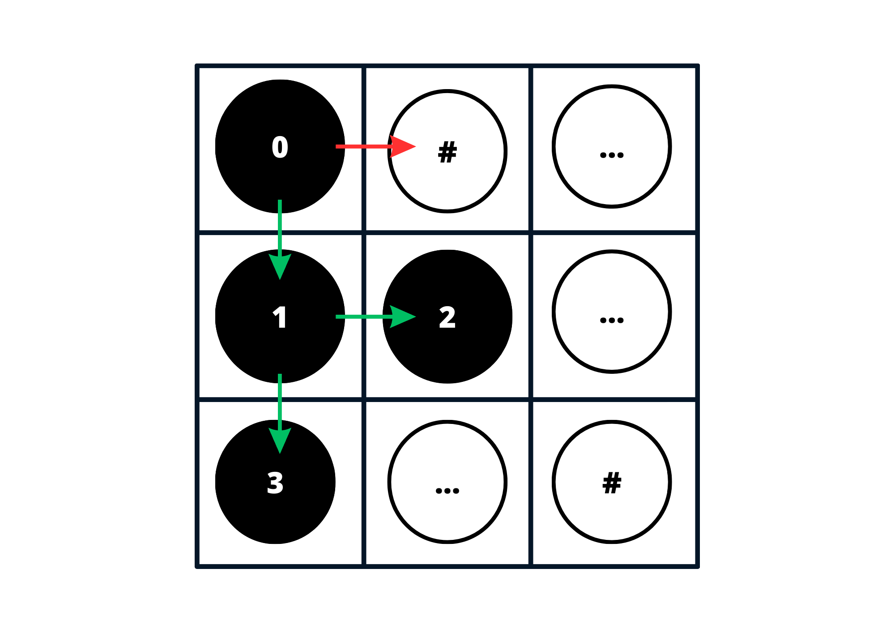
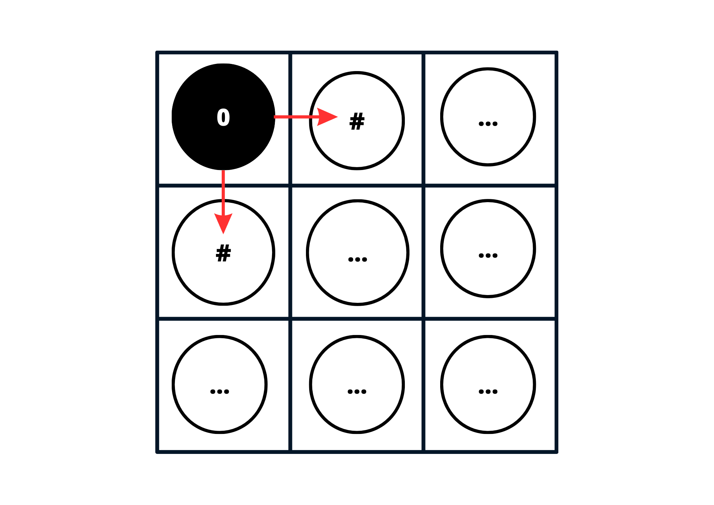

  

# Busca em Largura e Profundidade

#### Algoritmos e Estrutura de Dados

#### Compatibilidade e Desenvolvimento

  

## Índice

 - [Introdução](#Introdução)

 - [Objetivos](#Objetivos)

 - [Fundamentação Teórica](#Fundamentação-Teórica)
    - [Estruturas de Dados](#Estruturas-de-Dados)
    - [Algoritmos](#Algoritmos)
        - [DFS em Grafos](#DFS-em-Grafos)
        - [DFS em Matrizes Bidimensionais](#DFS-em-Matrizes-Bidimensionais)
        - [BFS em Grafos](#BFS-em-Grafos)
        - [BFS em Matrizes Bidimensionais](#BFS-em-Matrizes-Bidimensionais)

 - [Metodologia](#Metodologia)
    
    - [Arquivos](#Arquivos)

        - [Funcionamento](#Funcionamento)
            - [Primeira Leitura do Arquivo](#Primeira-Leitura-do-Arquivo)

            - [Percorrendo a Matriz](#Percorrendo-a-Matriz)

                - [Casos Especiais](#Casos-Especiais)
                
                - [Exemplo](#Exemplo)
                
                    - [Caminhamento aleatório](#Caminhamento-aleatório)
                
                    - [Caminhamento DFS](#Caminhamento-DFS)
                
                    - [Caminhamento BFS](#Caminhamento-BFS)
    
- [Conclusão](#conclusão)
    - [Grafos ou Matrizes?](#Grafos-ou-Matrizes?)
    - [Comparações Entre as Formas de Caminhamento](#Comparações-Entre-as-Formas-de-Caminhamento)

- [Compilação e Execução](#Compilação-e-Execução)
- [Ambiente de Desenvolvimento](#Ambiente-de-Desenvolvimento)

- [Referências](#Referências)
  

## Introdução

Este repositório apresenta a solução de um problema, a partir de diferentes métodos, proposto na disciplina de Algoritmos e Estruturas de Dados. Para tanto, a solução foi desenvolvida por 3 algoritmos distintos, sendo eles o DFS (Deep First Search, ou Busca em Profundidade), o BFS (Brandth First Search ou Busca em Largura) e uma forma de realizar buscas escolhendo entre casas adjascentes aleatoriamente. Com isso, considerou as seguintes colocações:

- $G$ - Um grafo qualquer.

- $V$ - Conjunto de vértices de um grafo.

- $E$ - Conjunto de arestas de um grafo.

- $n_{v}$ - Número de vértices em um percurso.

- $n_{e}$ - Número de arestas em um percurso.

- $N$ - Ordem das matrizes sendo representada pelos 2 primeiros números da primeira linha do arquivo `input.data`, portanto o código já espera que $N \in \mathbb{Z}$ e $N > 0$ e não trata essa variável.

- $i$ - Índice da linha de uma matriz, também pode ser abstraído como deslocamento na vertical, tal que $i \geq 0$ e $i \in \mathbb{Z}$.

- $j$ - Índice da coluna de uma matriz, também pode ser abstraído como deslocamento na horizontal, tal que $j \geq 0$ e $j \in \mathbb{Z}$.

- $a_{ij}$ - Elemento encontrado quando há deslocamento até a linha de índice $i$ e coluna de índice $j$.

- Caminho possível (**1**): Local em uma matriz onde se pode caminhar.

- Parede (**#**): Local onde não se pode passar dentro de uma matriz.

- Perigo (**\***): Local onde ao se passar haverá descrescimento em 1 da variável vida.

- Saída da matriz (**?**): Elemento encontrado durante o percorrimento da matriz que representa o encerramento de uma pesquisa ou a saída do labirinto.

## Objetivos:

A problemática proposta pelo trabalho incita os alunos da disciplina a efetuar o caminhamento por largura (BFS), profundidade (DFS) e aleatório de uma matriz de entrada com $N \ge 50$. Isso deve ser realizado seguindo as seguintes diretrizes de desenvolvimento:

- A matriz estará préviamente organizada para processamento em um arquivo `input.data`.

- O ponto inicial das três formas de caminhamento é o ponto onde se localiza o elemento $a_{00}$, ou seja, onde $i = 0$, $j=0$.

- A busca se limita ao escopo de matriz alocado na memória, portanto o programa caminha somente em $a_{ij}$ para $0 \le i \le N-1$ e $0 \le j \le N-1$.

- O programa foi escrito de modo à considerar comparações entre a execução dos 3 métodos de busca com diferentes tipos de entrada. Uma forma de facilitar essas comparações é realizando mensurações de tempo de execução destes métodos.

 

## Fundamentação Teórica

Para contextualizar o funcionamento do algoritmo, considere que um personagem caminha por um labirinto até encontrar uma saída definida por um ponto de interrogação($?$):

- Para solucionar o problema, a equipe utilizou a alocação dos valores de entradas em elementos $a_{ij}$ de uma matriz $M$ de ordem $N$. Portanto a estrutura de dados utilizada foi uma matriz $N$ x $N$.

- O personagem representa uma abstração para uma busca realizada em uma matriz, sendo que esta busca se encerra quando o elemento $?$ é encontrado;

- A parede representa uma casa por onde o personagem não consegue caminhar;

- O caracter $*$ representa uma casa que faz com que a pesquisa seja reiniciada.

É importante destacar que, quando o personagem passa pelo elemento $a_{ij} = *$, ele deverá de reiniciar sua busca, voltando à posição $a_{00}$. Além disso, todo o caminhamento realizado será considerado como não percorrido, e $a_{ij} = *$ será transformado em $a_{ij} = 1$.

### Estruturas de Dados

Estruturas de dados são formas de organizar e armazenar dados em computação, permitindo a eficiente manipulação e acesso aos mesmos. Elas são essenciais para o desenvolvimento de algoritmos e soluções eficientes para problemas complexos. Existem várias estruturas de dados disponíveis, cada uma com suas próprias características, uso e eficiência para diferentes cenários.

Pilha e Fila são estruturas de dados amplamente utilizadas na programação para armazenar e organizar elementos. A pilha é uma estrutura de dados LIFO (Last-In, First-Out), o que significa que o último elemento inserido é o primeiro a ser removido. já a fila é uma estrutura de dados FIFO (First-In, First-Out), o que significa que o primeiro elemento inserido é o primeiro a ser removido.

Em um caminhamento em matriz, a pilha é útil para percorrer em profundidade (depth-first) a partir de um ponto inicial. A pilha é usada para armazenar os elementos visitados e suas posições enquanto se avança pelo caminho. Ao atingir um ponto sem saída, é possível retroceder removendo o último elemento inserido na pilha, dizer ao programa para não visitar mais este elemento e continuar explorando outras possibilidades.

### Algoritmos

Os algoritmos para guiar o personagem idealizado, são buscas em largura e em profundidade. Estes algoritmos serão executados nas matrizes bidimensionais utilizadas como entradas no arquivo _`input.data`_. A partir desta entrada, os três algoritmos movem a partir de quatro direções:

<table align="center">
    <tr>
        <td align="center"></td>
        <td align="center">&#x21D1;</td>
        <td align="center"></td>
    </tr>
    <tr>
        <td align="center">&#x21D0;</td>
        <td align="center"></td>
        <td align="center">&#x21D2;</td>
    </tr>
    <tr>
        <td align="center"></td>
        <td align="center">&#x21D3;</td>
        <td align="center"></td>
    </tr>
</table>

#### Travessia ou Busca em Grafos

O entendimento dos algoritmos DFS e BFS tem grande importância no estudo de algoritmos e estruturas de dados. No estudo de grafos por exemplo, considera-se DFS e BFS formas de percorrer grafos em busca da validação de um percurso entre dois vértices, contagem de trilhas, circuitos e outras inferências sobre estes objetos computacionais.

Grafos são estruturas de dados que consistem em um conjunto de vértices conectados por arestas. Eles são usados para representar relações entre objetos ou entidades. Alguns algoritmos e problemas comuns em grafos são:

- Busca em Profundidade (DFS - Depth-First Search): Explora os vértices do grafo em profundidade antes de retroceder;

- Busca em Largura (BFS - Breadth-First Search): Explora os vértices do grafo em largura, nível por nível;

- Árvore de Busca: É um subgrafo do grafo original que conecta todos os vértices sem formar ciclos;

- Algoritmo de Dijkstra: Encontra o caminho mais curto entre dois vértices em um grafo ponderado;

- Algoritmo de Kruskal: Encontra a árvore geradora mínima de um grafo ponderado.

#### DFS em Grafos

Considerando um passeio realizado em um grafo finito, DFS funciona da seguinte forma: dado um vértice raiz, ou vértice de início, 1 vértice filho se torna o próximo vértice atual até que não hajam mais vértices filhos vizinhos inexplorados. Após isso o vértice raiz se torna o atual novamente e um novo percurso se inicia. Como pode ser visto um passeio com DFS no grafo abaixo segue a ordem formalmente representada como ${Passeio}: (0, 1, 2, 3, 5, 6)$.

 
<strong>Figura 1 -</strong> DFS no Grafo
 

 
Fonte: Construção pelo autor¹.
 
____________________________________________
 Criada usando o Canva assistir ao vídeo¹, Disponível no <a href="https://www.canva.com/design/DAFd8EjV-8w/M4fX0cOTTduzNNPJxuF73Q/edit?utm_content=DAFd8EjV-8w&utm_campaign=designshare&utm_medium=link2&utm_source=sharebutton">link</a>.

 
Observa-se que os vértices circulados de vermelho na imagem são vértices com adjascencia em vértices já visitados. Agora observe o vídeo abaixo:

 
<strong>Vídeo 1 -</strong> DFS no Grafo
 

 
Fonte: Construção pelo autor².
 
____________________________________________
 Criada usando o graphonline após assistir ao vídeo¹.

 

#### DFS em Matrizes Bidimensionais

Já em matrizes bidimensionais a DFS percorre uma linha ou coluna até que encontre um caracter que a faça reorientar a busca em outra direção(A reorientação acontece quando a busca identifica uma parede ou posição já percorrida anteriormente, portanto não se moverá para lá).

As direções escolhidas não podem fazer com que a busca passe em um elemento da matriz que já foi visitado previamente. Observe como a DFS percorre um coluna por completo e tem uma seta vermelha representando que não pode se mover para $a_{10}$ pois essa posição já foi percorrida previamente.

 
<strong>Figura 2 -</strong> DFS em Matriz
 

 
Fonte: Construção pelo autor³.
 
____________________________________________
 Criada usando o Canva¹, Disponível no <a href="https://www.canva.com/design/DAFd8EjV-8w/M4fX0cOTTduzNNPJxuF73Q/edit?utm_content=DAFd8EjV-8w&utm_campaign=designshare&utm_medium=link2&utm_source=sharebutton">link</a>.

#### BFS em Grafos

Considerando um passeio realizado em um grafo finito, BFS funciona da seguinte forma. Dado um vértice raiz, ou vértice de início, cada um de seus vértices adjascentes serão explorados e usados como próximos vértices atuais.Tendo estes como vértices vizinhos, na nova iteração estes terão seus adjascentes como percorridos e assim sucessivamente. A busca em largura encerra quando todos os vértices de um grafo tiverem sido percorridos.

Um fato interessante do BFS é que a pesquisa em largura permite inferir qual o menor caminho entre dois vértices no momento em que ambos estiverem sido percorridos na busca.Observe como isso acontece no vídeo e na imagem abaixo ${Passeio}: (1, 2, 3, 4, 5, 6, 7, 8, 9, 10)$. Considere que na imagem houveram apenas 3 iterações de busca em largura.

 
<strong>Figura 3 -</strong> BFS no Grafo
 

 
Fonte: Construção pelo autor⁴.
 
____________________________________________
 Criada usando o Canva assistir ao vídeo², Disponível no <a href="https://www.canva.com/design/DAFd8EjV-8w/M4fX0cOTTduzNNPJxuF73Q/edit?utm_content=DAFd8EjV-8w&utm_campaign=designshare&utm_medium=link2&utm_source=sharebutton">link</a>.

 
 
 - Observa-se que em 3 iterações utilizando o BFS,é possível inferir a menor distância entre alguns $v0$ e $v3$ ou $v0$ e $v4$. Mais especificamente a ditância é de 2 arestas nos respectivos percursos $P_{v0,v4} = (0,1,4)$ ou $P_{v0,v3} = (0,2,3)$. Faça um exercício e tente observar este padrão se repetindo no vídeo abaixo:

 
<strong>Vídeo 2 -</strong> BFS no Grafo
 

 
Fonte: Construção pelo autor⁵.
 
____________________________________________
 Criada usando o graphonline após assistir ao vídeo².

 

#### BFS em Matrizes Bidimensionais

- Já em matrizes bidimensionais, a BFS percorre todas as casas adjascentes à(s) casa(s) presente(s) por iteração de pesquisa. As direções escolhidas não podem fazer com que a busca passe em um elemento pesquisado. Perceba que a seta vermelha representa que não pode se mover para $a_{02}$ pois essa posição possui uma parede.

 
<strong>Figura 4 -</strong> DFS em Matriz
 

 
Fonte: Construção pelo autor⁶.
 
____________________________________________
 Criada usando o Canva⁶, Disponível no <a href="https://www.canva.com/design/DAFd8EjV-8w/M4fX0cOTTduzNNPJxuF73Q/edit?utm_content=DAFd8EjV-8w&utm_campaign=designshare&utm_medium=link2&utm_source=sharebutton">link</a>.

Observe como a BFS percorre casas adjascentes rapidamente em apenas 3 iterações. Enquanto isso a DFS foca ir em somente uma "direção" da matriz, ou seja, matemáticamente este percorreria vários vértices rapidamente, onde a distância entre eles depende de $n_{v}$ vértices vizinhos, portanto de $n_{e}-1$ arestas, afinal o percurso realizado gera um subgrafo onde todos os vértices tem grau $1$. Portanto BFS verifica vértices próximos(com arestas em comum) muito rapidamente, já o DFS pesquisa entre vértices distantes rapidamente. Com isso cada um destes é melhor para uma situação específica.

 

## Metodologia:

### Arquivos:

Para resolução do desafio alguns arquivos foram criados, dentre eles: 
 - `input.data`: Um arquivo que armazena o valor de $N$, ou seja, o tamanho da matriz e os elementos que serão armazenados ali.

- `Makefile` : Controla a geração dos executáveis e compilação dos mesmos(FREE SOFTWARE FOUNDATION, GNU make, 2023).

- `bfs.c` : Contém as funções criadas para implementação do algoritmo BFS.

- `bfs.h` : Contém a assinatura da função de `bfs.c`.

- `dfs.c` : Contém as funções criada para implementação do algoritmo DFS.

- `dfs.h` : Contém a assinatura da função de `dfs.c`.

- `random_walk.c` : Contém as funções criadas para implementação do de uma estrutura de fila.

- `random_walk.h` : Contém a assinatura das funções de `random_walk.c` e a implementação da estrutura de uma fila.

- `Maze.c` : Contém as funções criadas para leitura e processamento do labirinto.

- `Maze.h` : Contém a assinatura das funções criadas em `Maze.c`.

- `Queue.c` : Contém as funções criadas para implementação do de uma estrutura de fila.

- `Queue.h` : Contém a assinatura das funções de `Queue.c` e a implementação da estrutura de uma fila.

- `Stack.c` : Contém as funções criadas para implementação do de uma estrutura de pilha.

- `Stack.h` : Contém a assinatura das funções de `Stack.c` e a implementação da estrutura de uma pilha.

- `main.c` : Contém a execução das 3 funções principais _**RAND**_, _**DFS**_ e _**BFS**_ tendo seus respectivos tempos de execução sendo mensurados.

### Funcionamento

 #### Primeira Leitura do Arquivo
  A leitura das entradas do arquivo `input.data` é realizada apenas 1 vez, em primeiro lugar o código reconhece qual a ordem da matriz presente no arquivo, isso será realizado respectivamente pelas funções _**read_size**_ e _**read_matrix**_.

  A função _**read_size**_ é responsável por ler a primeira linha do arquivo de entrada e retornar $N$, já _**read_matrix**_ é responsável por ler os valores do arquivo e salvar em uma matriz. 

 #### Percorrendo a Matriz

  Há três formas de percorrer a matriz, são elas as funções _**RAND**_, _**DFS**_ e _**BFS**_. Todas estas funções param suas iterações quando o caracter **?** está em um elemento contido na posição presente. Além disso, quando o caracter na posição atual for igual a **\***, todas as funções apagam o caminho realizado entre $a_{00}$ e $a_{ij}$ tendo $i$ e $j$ atuais como referência e reiniciam as iterações partindo de novo do elemento ou posição $a_{00}$.

- Iterações na função _**DFS**_
  - A função _**DFS**_ adiciona a posição atual à uma pilha, ou seja, a casa 0,0.
  - À partir disso cada elemento adjascente será verificado como um elemento que pode ser adicionado a fila ou não (Os elementos adicionados à fila são $a_{ij}$ diferentes de $*$, #, $?$ ou que ainda não tenham sido exploradas). 
  - A verificação de casas adjascentes prioriza a posição que se encontra abaixo do elemento atual, diante disso enquanto a pilha não está vazia adiciona-se a primeira posição verificada disponível nesta pilha.
  - Elementos acessados a cada iteração são sempre adicionados no topo da pilha. 
  - Quando 4 posições adjascentes são verificadas de modo que as 4 sejam inacessíveis o algoritmo coloca uma parede na matriz onde estaria sua posição atual. 
  - Além disso ao se encontrar preso a posição do topo da pilha é exluída, portanto a penúltima posição da estrutura se torna a atual.
  
- Iterações na função _**BFS**_
  - A função _**BFS**_ adiciona a posição atual à uma fila, ou seja, a casa 0,0. 
  - À partir disso cada elemento adjascente será verificado como um elemento que pode ser adicionado a fila (Os elementos adicionados à fila são $a_{ij}$ diferentes de $*$, #, $?$ ou que ainda não tenham sido exploradas).Isso é feito enquanto a fila não está vazia.
  - Os elementos acessados a cada iteração serão adicionados no da fila(Caso atendam às premissas descritas previamente) e a cada iteração 1 elemento será removido da mesma.
  
- Iterações na função _**random_walk**_
    - A função _**random_walk**_ verifica posições adjascentes à posição atual através do acesso aleatório destas.
    
    - Toda vez que uma posição é sorteada e apresenta uma posição livre para se percorrer a posição atual se torna esta posição.
    
    - Dito isto o procedimento será realizado até que o caracter $?$ seja encontrado.

#### Tempo de execução
 
O programa armazena o tempo de execução das funções de pesquisa em variáveis do `main.c` chamando a função _**clock()**_ antes e depois de da chamada de cada uma das funções. Isso permite que haja uma mensuração de complexidade considerando o ambiente de execução no momento em que o comando _**make run**_ é executado por um sistema operacional contido em uma máquina específica.
 
 #### Casos Especiais

O programa não trata casos especiais onde a posição inicial se encontre cercada por paredes inicialmente. Portanto o caso da imagem abaixo pode trazer problemas de execução:

<strong>Figura 6</strong> - input.data    
 

 
Fonte: Construção pelo autor⁸.
 
____________________________________________
 Criada usando o Canva⁸, Disponível no <a href="https://www.canva.com/design/DAFd8EjV-8w/M4fX0cOTTduzNNPJxuF73Q/edit?utm_content=DAFd8EjV-8w&utm_campaign=designshare&utm_medium=link2&utm_source=sharebutton">link</a>.

Nos casos dos algoritmos de DFS e BFS, caso não exista um objetivo ***?***, o loop do programa acaba quando, respectivamente, a pilha e a fila acabam. Porém, no caso do algoritmo aleatório, o programa entra em um _loop_ infinito. Tal fato também ocorre quando existe um objetivo, mas este está inacessível, ou seja, cercado por paredes. Isto acontece porque o algoritmo aleatório simplesmente caminha aleatoriamente, sem rumo, até que ele chegue ao objetivo. Se ele não encontra um objetivo, ele não saí do _loop_.

 
 
## Exemplo

Ao trabalhar com uma matriz em um arquivo de entrada, geralmente há um formato específico a ser seguido para garantir a correta leitura e interpretação dos dados. Em um arquivo de entrada de texto simples, os elementos da matriz são armazenados como sequências de caracteres separadas por caracteres delimitadores. Cada linha representa uma linha da matriz, e os elementos correspondentes são separados por espaços, conforme ilustrado na tabela abaixo:

<table align="center">
    <tr>
        <td align="center">*</td>
        <td align="center">2</td>
        <td align="center">3</td>
        <td align="center">*</td>
    </tr>
    <tr>´
        <td align="center">4</td>
        <td align="center">#</td>
        <td align="center">5</td>
        <td align="center">6</td>
    </tr>
    <tr>
        <td align="center">7</td>
        <td align="center">#</td>
        <td align="center">*</td>
        <td align="center">#</td>
    </tr>
    <tr>
        <td align="center">8</td>
        <td align="center">#</td>
        <td align="center">9</td>
        <td align="center">?</td>
    </tr>
</table>

A fim de facilitar a explicação de como o progrmaa funciona, optou-se por utilizar uma entrada pequena. Também decidiu-se em adotar números possíveis diferentes de $1$. Com isso, é possível descrever os caminhos feitos nos três métodos, assim como observar onde o programa trocou um perigo ***\**** por ***1***.

### Caminhamento aleatório

Para realizar o caminhamento aleatório, utilizou-se um loop _do while_. A cada iteração, uma direção aleatória válida é escolhida para mover. A posição é atualizada de acordo com a direção escolhida. O processo continua até que o objetivo <b>?</b> seja alcançado. Caso um inimigo <b>*</b> seja encontrado, o elemento em que o personagem se encontra volta a ser o inicial $a_{00}$, e todas as casas visitadas são esquecidas com a função _memset_. A saída do programa é mostrada a seguir:

<table align="center">
    <tr>
        <td align="center">1</td>
        <td align="center">2</td>
        <td align="center">3</td>
        <td align="center">1</td>
    </tr>
    <tr>
        <td align="center">4</td>
        <td align="center">#</td>
        <td align="center">5</td>
        <td align="center">6</td>
    </tr>
    <tr>
        <td align="center">7</td>
        <td align="center">#</td>
        <td align="center">1</td>
        <td align="center">#</td>
    </tr>
    <tr>
        <td align="center">8</td>
        <td align="center">#</td>
        <td align="center">9</td>
        <td align="center">?</td>
    </tr>
</table>

O tempo de execução do exemplo foi de $0,203 ms$. É possível notar ainda que todos os perigos observados no arquivo de entrada se transformaram em $1$. Isto ocorre porque, quando o personagem encontra um perigo, além de voltar ao início, ele marca o elemento em que este perigo se encontra como um caminho possível. Durante a execução do programa, o personagem visitou todas os elementos da matriz antes de encontrar o objetivo.

### Caminhamento DFS

No caminhamento DFS, o progama trabalha dando preferência às direções em uma ordem pré-estabelecida:

<ol>
    <li>A linha de baixo;</li>
    <li>A próxima coluna;</li>
    <li>A linha de cima;</li>
    <li>A coluna anterior.</li>
</ol>

O programa foi empilhando os elementos visitados, tentando encontrar o objetivo. Caso o personagem chegue a um beco sem saída, o programa começa a desempilhar a fila, colocando paredes <b>#</b> nestes elementos, para que o personagem não volte a visitá-los. O programa trabalhou com uma matriz de booleanos, fazendo com que o personagem não visite os elementos já visitados. A matriz de saída é ilustrada abaixo:

<table align="center">
    <tr>
        <td align="center">1</td>
        <td align="center">2</td>
        <td align="center">3</td>
        <td align="center">*</td>
    </tr>
    <tr>
        <td align="center">#</td>
        <td align="center">#</td>
        <td align="center">5</td>
        <td align="center">6</td>
    </tr>
    <tr>
        <td align="center">#</td>
        <td align="center">#</td>
        <td align="center">1</td>
        <td align="center">#</td>
    </tr>
    <tr>
        <td align="center">#</td>
        <td align="center">#</td>
        <td align="center">9</td>
        <td align="center">?</td>
    </tr>
</table>

Assim como no aleatório, caso o personagem encontre um perigo <b>*</b>, ele marca como caminho possível <b>1</b>, retorna ao início, zerando a matriz de booleanos, ou seja, esquece os elementos já visitados. Como é possível perceber, a primeira coluna foi marcada com paredes <b>#</b>, pois o personagem seguiu este caminho, encontrou um beco sem saída, e foi voltando até encontrar um caminho para encontrar o objetivo. Durante a execução, o personagem somente visitou o objetivo da última coluna. Todos os outros elementos, exceto as paredes, foram visitados. O tempo de execução do DFS para o arquivo de entrada foi de $0,118 ms$.

### Caminhamento BFS

No caminhamento BFS, o progama trabalha dando preferência às direções em uma ordem pré-estabelecida:

<ol>
    <li>A próxima coluna;</li>
    <li>A linha de baixo;</li>
    <li>A coluna anterior.</li>
    <li>A linha de cima;</li>
</ol>

O programa foi descobrindo os elementos conforme a ordem citada acima, colocando-os em uma fila. Os elementos guardados na fila então começaram a ser analisados, procurando o objetivo. Assim como no DFS, o BFS também utilizou-se de uma matriz de booleanos, para que o personagem não retorne aos elementos já visitados. A matriz de saída é ilustrada abaixo:

<table align="center">
    <tr>
        <td align="center">1</td>
        <td align="center">2</td>
        <td align="center">3</td>
        <td align="center">1</td>
    </tr>
    <tr>
        <td align="center">4</td>
        <td align="center">#</td>
        <td align="center">5</td>
        <td align="center">6</td>
    </tr>
    <tr>
        <td align="center">7</td>
        <td align="center">#</td>
        <td align="center">1</td>
        <td align="center">#</td>
    </tr>
    <tr>
        <td align="center">8</td>
        <td align="center">#</td>
        <td align="center">9</td>
        <td align="center">?</td>
    </tr>
</table>

Outra semelhança com o DFS, é que o BFS também trata os perigos <b>*</b> marcando como caminhos possíveis <b>1</b>, retornando ao início e zerando a matriz de booleanos. O tempo de execução do BFS foi de $0,123 ms$. Todos os elementos foram visitados durante a execução do programa.

## Conclusões

### Grafos ou matrizes?

Como foi dito anteriormente o problema pode ser resolvido de diversas formas, uma delas é usufruindo de grafos. As relações entre vértices permitem inferências matemáticas mais plurais e complexas que as propostas aqui. Considerando que implementações realizadas aqui se restringem ao percorrimento de um espaço muito grande, a implementação de uma estrutura de dados tão complexa quanto o grafo poderia ser um custo desnecessário. Portanto os grafos não foram uma indicação nem uma escolha para solucionar o problema proposto.

### Comparações entre as formas de caminhamento

Diante das diferentes entradas propostas, o número e posições dos caracteres **#**, **\***, **1** e **?** foram alterados no arquivo de entrada. Com isso, percebeu-se que, em casos muito raros, o BFS se torna mais rápido que o DFS. Além disso, observou-se que o caminhamento aleatório é mais lento que ambos na maioria dos casos.

Em casos onde a objetivo está próxima ao elemento inicial, com paredes bloqueando sua passagem, o DFS caminha até a região onde o valor de $i$ dos elementos $a_{ij}$ tende a se aproximar do valor de $N$. Neste caso, observou-se que o BFS é mais rápido, seguido, normalmente, do aleatório e, por último, o DFS.

Cada tipo de caminhamento tem suas próprias características e é adequado para diferentes situações. O DFS é mais adequado quando se deseja explorar profundamente em um ramo antes de retroceder, enquanto o BFS é mais adequado para uma exploração ampla e para encontrar caminhos mais curtos. Já o caminhamento aleatório é mais adequado para casos em que a ordem de exploração não é relevante ou quando se deseja explorar várias possibilidades sem seguir uma estratégia específica.

É importante ressaltar que o caminhamento aleatório não garante que todos os elementos da matriz sejam visitados ou que o objetivo seja alcançado. A aleatoriedade introduz incerteza no caminho percorrido e pode resultar em diferentes resultados a cada execução.

## Compilação e Execução

Para compilação e execução do código é necessário que seja criado um arquivo Makefile. Para uso deste arquivo da forma correta, siga as diretrizes de execução abaixo:

<table>

<tr>
<td colspan = '1'><strong>Comandos</strong></td>
<td align = "center" colspan = '1'><strong>Funções</strong></td>
</tr>

<tr>
<td align="center"><strong><i>make clean</i></strong>
</td>
<td align="center">Deleta o arquivo executável e todos os arquivos objetos do diretório. (FREE SOFTWARE FOUNDATION, GNU make, 2023)</td>
</tr>
<tr>
<td align="center"><strong><i>make</i></strong></td>
<td align="center">Compila diferentes partes do programa através do g++ e cria um arquivo executável na pasta build. </td>
</tr>
<tr>
<td align="center"><strong><i>make run</i></strong></td>
<td align="center">Executa o programa da pasta build após a realização da compilação. (PIRES, MICHEL, 2023)</td>
</tr>
</table>

## Ambiente de Desenvolvimento:
O código foi desenvolvido e testado no seguinte ambiente de desenvolvimento:

<table>
<tr>
<td colspan = '1' align="center"><strong>Peças</strong></td>
<td align = "center" colspan = '1'><strong>Especificações</strong></td>
</tr>

<tr>
<td align="center"><strong><i>Processador</i></strong>
</td>
<td align="center">AMD Athlon(tm) 5150 APU with Radeon(tm) R3</td>
</tr>
<tr>
<td align="center"><strong><i>Memória RAM</i></strong></td>
<td align="center">8 GB </td>
</tr>
<tr>
<td align="center"><strong><i>Sistema Operacional</i></strong></td>
<td>Ubuntu 22.04.2 LTS (Jammy Jellyfish)</td>
</tr>
</table>

  

## Referências <!--Idea!! CITAR O NÍVIO ZIVIANI-->

[1] Depth First Search (DFS) Explained: Algorithm, Examples, and Code. Disponível em: <https://www.youtube.com/watch?v=PMMc4VsIacU&t=797s>. Acesso em: 23 mai. 2023.

[2] Breadth First Search (BFS): Visualized and Explained. Disponível em: <https://www.youtube.com/watch?v=xlVX7dXLS64>. Acesso em: 24 maio. 2023.

[3] Create Graph online and find shortest path or use other algorithm. Disponível em: <https://graphonline.ru/en/>.

[4] Introdução à Teoria dos Grafos – Aula 5 – Grau de um vértice e o problema das Pontes de Königsberg. Disponível em: <https://www.youtube.com/watch?v=125pPCIRjZ8>. Acesso em: 24 maio. 2023.

[5] PIRES, MICHEL - Repositório GitHub, @mpiress: GenerateDataToMatrix - Disponível em: https://github.com/mpiress/GenerateDataToMatrix/blob/main/src/mat.h. Acessado em 15 de Maio de 2023.

[6] GNU make. Disponível em: <https://www.gnu.org/software/make/manual/make.html>. Acessado em XX de Maio de 2023.

[7] GNU Make. Disponível em: <https://www.gnu.org/software/make/>. Acesso em: mai. 23DC.

[8] ALFREDO, A. et al. Grafos. [s.l: s.n.]. Disponível em: <https://homepages.dcc.ufmg.br/~loureiro/md/md_9Grafos.pdf>.

## Contato
 
<dig align="center">

