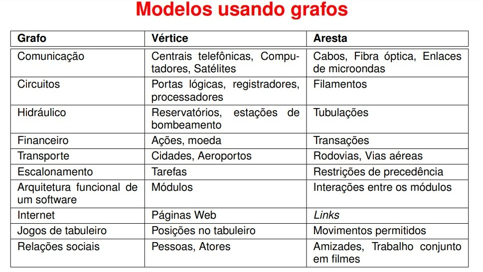

# Busca em Largura e Profundidade

#### Algoritmos e Estrutura de Dados

#### Compatibilidade e Desenvolvimento
 

  

  

## Introdução
Este repositório apresenta  a solução para um problema proposto na disciplina de Algoritmos e Estruturas de Dados. Para isso foi requisitado que a solução fosse desenvolvida em forma de 3 algoritmos, são eles o DFS(Deep First Search, ou Busca em Profundidade), o BFS(Brandth First Search ou Busca em Largura) e uma forma de realizar buscas escolhendo entre casas adjascentes aleatoriamente. Para isso considere as seguintes colocações:

- Nomes de diretórios, ou arquivos serão referênciados da seguinte forma: `Nome.txt` ou `Diretório_2`.

- $G$ - Um grafo qualquer.

- $V$ - Conjunto de vértices de um grafo.

- $E$ - Conjunto de arestas de um grafo.

- $K$ - Número de matrizes de entrada presentes no arquivo `input.data`.

- $N$ - Ordem das matrizes sendo representada pelos 2 primeiros números da primeira linha do arquivo `input.data`, portanto o código já espera que $N \in \mathbb{Z}$ e $N\geq 0$ e não trata essa variável.

- $i$ - Índice da linha de uma matriz, também pode ser abstraído como deslocamento na vertical, tal que $i \geq 0$ e $i \in \mathbb{Z}$.

- $j$ - Índice da coluna de uma matriz, também pode ser abstraído como deslocamento na horizontal, tal que $j \geq 0$ e $j \in \mathbb{Z}$.

- $a_{ij}$ - Elemento encontrado quando há deslocamento até a linha de índice $i$ e coluna de índice $j$.

- _Tralha ou jogo da velha_ - **Parede**: Local onde não se pode passar dentro de uma matriz.

- $*$ - **Perigo**: Local onde ao se passar haverá descrescimento em 1 da variável vida.

- $a_{ij}$ - Elemento encontrado quando há deslocamento até a linha de índice $i$ e coluna de índice $j$.

- $?$ - Elemento encontrado durante o percorrimento da matriz que representa o encerramento de uma pesquisa ou a saída do labirinto.

- Nomes de comandos digitados no terminal,funções ou variáveis serão referênciados da seguinte forma: _**touch main.cpp**_, _**make run**_.

- Para as **Figuras** de **1** à **x**, considere a legenda de cores:

    -   Azul:Uma posição futura possível.</kbd>
    -   Cinza: Uma posição futura impossível.
    -   Laranja: Posição atual ou inicial.
    -   Rosa: Posição futura escolhida.

### Contextualizando os Algoritmos
- Para contextualizar o funcionamento do algoritmo, considerer que um personagem caminha por um labirinto até encontrar uma saída definida por um ponto de interrogação:
    - O personagem representa uma abstração para uma busca realizada em uma matriz e essa busca se encerra quando o elemento $?$ é encontrado na matriz.
    -   O personagem inicia sua viajem com $10$ pontos de vida.
    -   O caracter $*$ representa uma casa por onde caso o ambicioso passe, haverá descrescimento de um ponto de vida do mesmo. Denomina-se o $*$ como perigo.
    -   O personagem morre ao enfrentar o número de perigos que o leve a ter pontos de vida igual a $0$.
    -   A parede representa uma casa por onde o ambicioso não consegue passar.
    

### Grafos
- No desafio Labirinto Recorrente(<a href = "https://github.com/Getulio-Mendes/LabirintoRecorrente">Getúlio</a>, <a href = "https://github.com/rafaegont1/O-labirinto-recorrente">Rafel</a> e <a href = "https://github.com/jAzz-hub/Recurrent_Labyrinth">João</a>), citar e estudar um pouco sobre o objeto matemático descrito como Grafo era uma opção para aprimorar a documentação desenvolvida contribuindo para o entendimento do leitor à cerca do estudo elaborado nos repositórios. Contúdo no caso deste trabalho, é essêncial que a documentação represente uma introdução ao tema para melhor modelagem dos algoritmos desenvolvidos, afinal eles são aplicados majoritariamente à grafos e tiveram no caso deste repositório um caso nem tão recorrente de percorrimento em matrizes bidimensionais não associadas diretamente à grafos.
#### O que é um Grafo?
- Um grafo é uma forma de representar relações entre objetos. Para que isso se torne mais claro, os objetos ou abstrações do que quer que necessite ser representado pelo grafo se denomina vértice, e o nome da relação entre dois vértices é aresta. Portanto um grafo é definido pela seguinte notação matemática:

  - $G(V,E)$

#### Os vértices:
- Os vertices, normalmente representados por $v_{i}$, estes estão contidos em um conjunto $V$.

#### As Arestas:
- As arestas, conectam os vértices de um grafo através de relações, elas são representadas por $e_{i}$ e estão contidas em formas como $(v_{1}$ x $v_{2})$ por exemplo dentro de um conjunto $E$.

#### Modelos Usando Grafos:

- Os grafos podem ser usados na representação de Derivação Sintática, Conectividade na Internet e muitas outras coisas (ALFREDO, 2018).

<strong>Figura 1</strong> - Aplicações de grafos
 

 
Fonte: Captura de tela pelo autor¹.
 
____________________________________________
 ¹Disponível no <a href="https://docs.google.com/spreadsheets/d/1nbK5ybx7Lwp98y11IScqkPUhSizV1jwG1KyGsdvTEjI/edit#gid=0">PDF do professor Antonio Alfredo Ferreira Loureiro</a>.

 

### Busca em Profundidade
- Deep First Search(DFS) ou Busca em profundidade é um algoritmo que desenvolvido para percorrer um grafo, ele se propõe à fazer isso da seguinte forma:
    - Em primeiro lugar um vértice inicial é escolhido como ponto de partida.
    - Adiante um vértice relacionado à este é escolhido como uma opção de deslocamento.
    - Caso o vértice observado...

*Alternativa de abordagem:* Percursos ou circuitos podem representar conceitos mais completos ao se tratar de relações entre abstrações com informações. Os Grafos são a trativa adequada para resolver esse tipo de problema, definidos como estruturas formadas por objetos que apresentam uma relação comum, abrangem muitos problemas. Caso haja interesse em modelar os conceitos contextualizados nessas estruturas, é valida à consulta dos seguintes links: <a href = " " >Aula em português</a> , <a href = " " >Leitura</a> e <a href="https://graphonline.ru/pt/">Modelagem e experimentação</a>;

referências:
https://www.youtube.com/watch?v=s-CYnVz-uh4&t=122s

https://www.youtube.com/watch?v=s-CYnVz-uh4&t=122s

https://www.youtube.com/watch?v=xlVX7dXLS64

links úteis:
"https://graphonline.ru/pt/"
